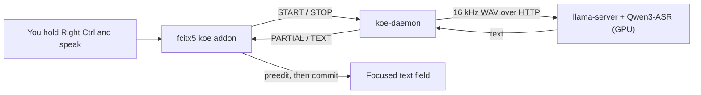

# fcitx5-koe

Hold-to-talk speech-to-text for [fcitx5](https://fcitx-im.org). Hold a hotkey, speak, release, and the text is typed into the focused field. While you speak, the transcript so far is shown inline as underlined preedit text.

It works on top of any active input method, on Wayland and X11. Speech recognition runs on any OpenAI-compatible API: locally on your GPU with [Qwen3-ASR](https://github.com/QwenLM/Qwen3-ASR) through llama.cpp, or on a cloud API.



## Features

- **Hold to talk.** Default hotkey is Right Ctrl. Configurable in fcitx5-configtool.
- **Live preview.** Partial text appears as underlined preedit about every 0.7 s.
- **Fast.** A 3-9 s clip transcribes in about 0.2-0.35 s on an RTX 4050.
- **Language passthrough.** Language string is sent to the backend (`auto` by default, or fixed).
- **Pluggable backend.** Any server that speaks `POST /v1/audio/transcriptions`: local llama-server, OpenAI, or a self-hosted server.
- **Safe defaults.** Silence gate, focus checks (text is never typed into the wrong window), shortcut safety for modifier hotkeys.

## Requirements

- Linux with fcitx5 5.1+ and PipeWire.
- A C++ toolchain plus distro packages (Arch, Ubuntu 24.04+, Fedora).
- For local recognition: an NVIDIA GPU with ~2.5 GB free VRAM, plus the Qwen3-ASR model files (~2.5 GB). No GPU? Use cloud mode.

## Quick start

```bash
./scripts/install.sh
```

- Default is a cmake build into `~/.local`. Deps install via pacman, apt, or dnf.
- Local GPU: build llama.cpp with CUDA support first (see llama.cpp docs). `install.sh` picks up `llama-server` from PATH.
- Cloud API instead of local GPU: `./scripts/install.sh --cloud-only`.
- Flags: `--no-deps` skips the package install, `--prefix DIR` changes the location, `--dry-run` previews.
- Log out and back in so fcitx5 sees the addon, then hold **Right Ctrl** in a text field and speak.

Prefer manual steps? Download models with `./scripts/setup-models.sh download qwen`, then:

```bash
cmake -B build -S . -DCMAKE_BUILD_TYPE=Release -DCMAKE_INSTALL_PREFIX="$HOME/.local"
cmake --build build && cmake --install build
```

Test without installing: `./scripts/dev-run.sh` builds, starts llama-server and `koe-daemon`, restarts fcitx5 with the addon. Ctrl+C stops it all and restores fcitx5.

## Configuration

- **Addon** (fcitx5-configtool, "Koe Voice Input"): hotkey and language string (default `auto`, passed through to the backend).
- **Daemon**: `~/.config/koe/config.toml`. Without a file, the built-in local profile is used. See [nix/config.example.toml](nix/config.example.toml).

```toml
active = "local"
min_rms = 0.005

[profile.local]
base_url = "http://127.0.0.1:8178"
model = "qwen3-asr-1.7b"
partial_interval_ms = 700
```

## Documentation

Full docs are in [docs/](docs/index.md):

| Page | Covers |
|---|---|
| [Overview](docs/1-overview.md) | What it is, components, repo layout |
| [Architecture](docs/2-architecture.md) | Processes, end-to-end flow, design choices |
| [Wire Protocol](docs/2.1-wire-protocol.md) | Socket messages between addon and daemon |
| [fcitx5 Addon](docs/3-fcitx5-addon.md) | Hotkey state machine, preedit, focus rules |
| [koe-daemon](docs/4-koe-daemon.md) | Event loop, request lifecycle, threading |
| [Audio Capture](docs/4.1-audio-capture.md) | PipeWire recording |
| [Transcription](docs/4.2-transcription.md) | HTTP backend, live partials, silence gate |
| [Configuration](docs/4.3-configuration.md) | Every option of both parts |
| [Deployment](docs/5-deployment.md) | Build outputs, dev script, advanced notes |
| [ASR Model](docs/6-asr-model.md) | Backend options, benchmarks, limits |
| [Troubleshooting](docs/7-troubleshooting.md) | Common problems and fixes |

## License

MIT, see [LICENSE](LICENSE).
