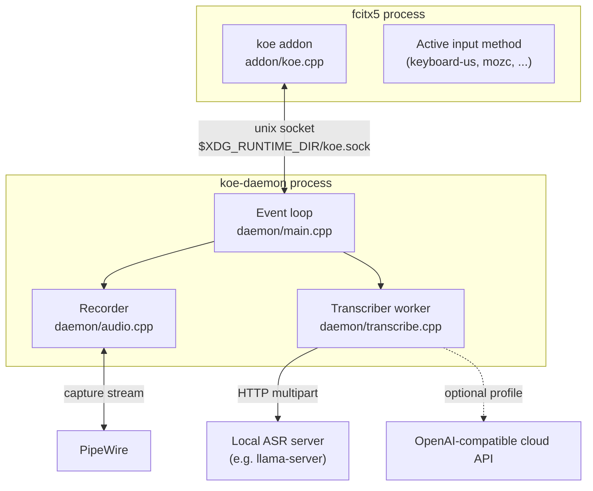

# Overview

<details>
<summary>Relevant source files</summary>

- [README.md](../README.md)
- [CMakeLists.txt](../CMakeLists.txt)
- [package.nix](../package.nix)
- [addon/koe.cpp](../addon/koe.cpp)
- [daemon/main.cpp](../daemon/main.cpp)
- [common/protocol.h](../common/protocol.h)

</details>

## Purpose and Scope

fcitx5-koe adds voice dictation to fcitx5. The user holds a hotkey, speaks, and releases. The spoken words are typed into whatever text field has focus. This page explains what the system is made of and where each part lives. For how the parts talk to each other, see [Architecture](2-architecture.md).

## What the user sees

1. Focus a text field. Hold **Right Ctrl**.
2. The fcitx5 panel shows "🎙 Recording...". After about 0.7 s, underlined text starts to appear at the cursor and grows as you speak.
3. Release the key. The panel shows "⏳ Transcribing...". About 0.3 s later the underlined text is replaced by the final transcript, which is committed as normal text.

## Components

| Component | Kind | Role |
|---|---|---|
| `koe` addon | fcitx5 module (`libkoe.so`) | Catches the hotkey, shows status and preedit, commits text |
| `koe-daemon` | User process | Records the mic, calls the ASR backend, streams results back |
| ASR backend | User process or cloud API | Any OpenAI-compatible endpoint (local llama-server, OpenAI, self-hosted) |
| `common/protocol.h` | Header-only library | Line protocol shared by addon and daemon |



Sources: [addon/koe.cpp:26-41](../addon/koe.cpp#L26-L41), [daemon/main.cpp:114-153](../daemon/main.cpp#L114-L153), [daemon/transcribe.cpp:115-125](../daemon/transcribe.cpp#L115-L125)

## Technology stack

| Area | Choice |
|---|---|
| Language | C++20 |
| Build | CMake, packaged with Nix (`package.nix`) |
| Input method framework | fcitx5 5.1 addon API |
| Audio | libpipewire-0.3 (`pw_thread_loop` + `pw_stream`) |
| HTTP | libcurl (multipart upload) |
| JSON / TOML | nlohmann_json / toml++ |
| ASR backend | Any `POST /v1/audio/transcriptions` server (local or cloud, e.g. Qwen3-ASR-1.7B in llama.cpp with CUDA) |

Sources: [package.nix:1-46](../package.nix), [daemon/CMakeLists.txt](../daemon/CMakeLists.txt), [addon/CMakeLists.txt](../addon/CMakeLists.txt)

## Repository layout

```
addon/              fcitx5 module: hotkey, preedit, commit, config UI
common/protocol.h   message format/parse + LineBuffer, used by both sides
daemon/             koe-daemon: socket server, PipeWire capture, HTTP backend
nix/module.nix      NixOS module: addon + systemd user services
nix/config.example.toml   commented daemon config
scripts/dev-run.sh  start everything by hand for testing
package.nix, default.nix, shell.nix   Nix build and dev shell
```

## Related pages

- [Architecture](2-architecture.md) for the full request flow.
- [Deployment](5-deployment.md) to install or run it.
