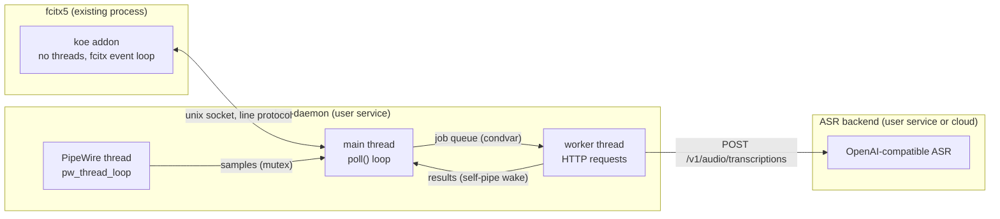
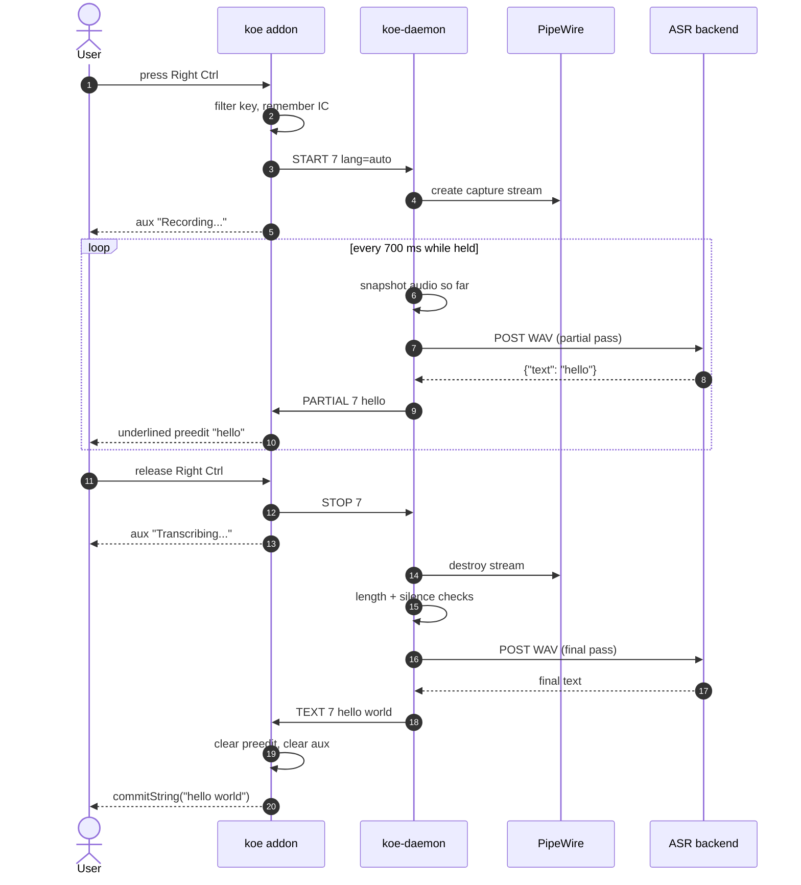

# Architecture

Relevant source files

- [addon/koe.cpp](../addon/koe.cpp)
- [daemon/main.cpp](../daemon/main.cpp)
- [daemon/audio.cpp](../daemon/audio.cpp)
- [daemon/transcribe.cpp](../daemon/transcribe.cpp)
- [common/protocol.h](../common/protocol.h)
- [nix/module.nix](../nix/module.nix)

## Purpose and Scope

This page describes how the three processes cooperate to turn a key hold into typed text, and why the system is split this way. Message details are in [Wire Protocol](2.1-wire-protocol.md). Per-component internals are in [fcitx5 Addon](3-fcitx5-addon.md) and [koe-daemon](4-koe-daemon.md).

## Process model

| Process | Threads | Owns |
|---|---|---|
| fcitx5 + koe addon | fcitx5 main loop only | Hotkey state, preedit, commit |
| koe-daemon | main, PipeWire loop, worker | Mic stream, request state, HTTP client |
| ASR backend | backend internal | Model weights (local GPU) or cloud API |

Sources: [addon/koe.cpp:26-41](../addon/koe.cpp#L26-L41), [daemon/main.cpp:121-153](../daemon/main.cpp#L121-L153), [daemon/audio.cpp:15-63](../daemon/audio.cpp#L15-L63)

## End-to-end flow

The sequence below shows one dictation with live partials enabled (`partial_interval_ms = 700`).

Key rules that make the flow safe:

- **One result per STOP.** The daemon always answers a `STOP` with exactly one `TEXT` or `ERROR`. The addon relies on this to clear its "Transcribing..." state.
- **No partial after the final.** Partial results are only sent while the recording is still active.
- **Focus check before typing.** The final text is committed only if the original input context still exists and has focus. Otherwise it is shown as a notification so it is not lost.

Sources: [addon/koe.cpp:419-489](../addon/koe.cpp#L419-L489), [addon/koe.cpp:315-351](../addon/koe.cpp#L315-L351), [daemon/main.cpp:574-619](../daemon/main.cpp#L574-L619), [daemon/main.cpp:746-787](../daemon/main.cpp#L746-L787)

## Design decisions

### Separate daemon instead of doing everything inside fcitx5

| Concern | Inside fcitx5 | Separate daemon (chosen) |
|---|---|---|
| A crash in audio or HTTP code | Kills keyboard input | Only voice input stops |
| Blocking work (HTTP, up to seconds) | Needs threads inside fcitx5 | Daemon has its own worker thread |
| Restart / upgrade backend | Restart fcitx5 | Restart one user service |

The addon has no threads at all. It only reacts to fcitx5 events and to its socket becoming readable.

Sources: [addon/koe.cpp:146-194](../addon/koe.cpp#L146-L194), [addon/koe.cpp:248-289](../addon/koe.cpp#L248-L289)

### Backend behind an HTTP API instead of linked into the daemon

Any OpenAI-compatible server works for `POST /v1/audio/transcriptions`. So a "backend" is only `base_url` + `model` + optional API key. Switching between local GPU and cloud is a config change, and the daemon has one code path. The cost is one more process and a localhost HTTP hop, which is under a millisecond.

Sources: [daemon/transcribe.cpp:115-225](../daemon/transcribe.cpp#L115-L225), [daemon/config.cpp:82-190](../daemon/config.cpp#L82-L190)

### Live partials by re-transcription

The backend has no streaming ASR. The daemon instead re-sends the audio captured so far at a fixed interval and forwards the result as `PARTIAL`. On the GPU one pass takes about 0.2-0.35 s for 3-9 s of audio, so this is cheap. For paid cloud APIs it is off by default because each pass is a billed request. See [Transcription](4.2-transcription.md#live-partials).

### Module addon, not an input method

The addon is an fcitx5 `Module`. It watches key events in the `PreInputMethod` phase, so it works no matter which input method is active. The user never has to switch to a "voice" input method.

Sources: [addon/koe.cpp:26-41](../addon/koe.cpp#L26-L41), [addon/koe.conf.in](../addon/koe.conf.in)

## Related pages

- [Wire Protocol](2.1-wire-protocol.md)
- [fcitx5 Addon](3-fcitx5-addon.md)
- [koe-daemon](4-koe-daemon.md)
