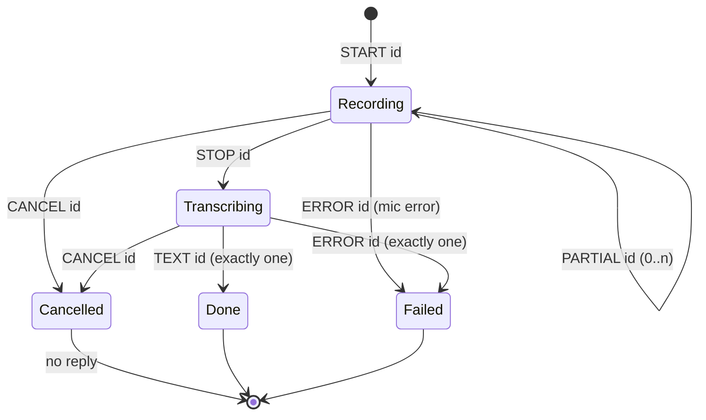

# Wire Protocol

<details>
<summary>Relevant source files</summary>

- [common/protocol.h](../common/protocol.h)
- [daemon/main.cpp](../daemon/main.cpp)
- [addon/koe.cpp](../addon/koe.cpp)

</details>

## Purpose and Scope

The addon and the daemon talk over a unix stream socket using a small text protocol. This page defines the messages, their ordering rules, and the escaping and buffering helpers in `common/protocol.h`. Both sides include the same header, so they cannot drift apart.

## Transport

| Property | Value |
|---|---|
| Socket | `$XDG_RUNTIME_DIR/koe.sock` (daemon `--socket` can override) |
| Type | `AF_UNIX`, `SOCK_STREAM`, non-blocking on both ends |
| Permissions | `0600`, owner only |
| Framing | One message per line, terminated by `\n`, UTF-8 |
| Max line | 64 KiB. A longer line makes the receiver drop the connection |

Sources: [daemon/main.cpp:277-330](../daemon/main.cpp#L277-L330), [addon/koe.cpp:146-194](../addon/koe.cpp#L146-L194), [common/protocol.h:190-238](../common/protocol.h#L190-L238)

## Messages

| Direction | Line | Meaning |
|---|---|---|
| addon → daemon | `START <id> lang=<code>` | Start recording request `<id>`. `<code>` is a backend language string like `auto` or `en` (max 16 bytes, no spaces) |
| addon → daemon | `STOP <id>` | Stop recording and transcribe |
| addon → daemon | `CANCEL <id>` | Drop the recording or pending result. No reply |
| daemon → addon | `PARTIAL <id> <text>` | Transcript so far, while still recording |
| daemon → addon | `TEXT <id> <text>` | Final transcript. Empty text means "nothing to type" |
| daemon → addon | `ERROR <id> <message>` | Request failed |

`<id>` is a decimal `uint64`, chosen by the addon and increasing from 1.

Sources: [common/protocol.h:14-20](../common/protocol.h#L14-L20), [common/protocol.h:96-188](../common/protocol.h#L96-L188)

## Ordering rules



1. After `START`, the daemon may send zero or more `PARTIAL` lines.
2. After `STOP`, the daemon sends **exactly one** `TEXT` or `ERROR`, and no further `PARTIAL` for that id.
3. A `STOP` for an id that is not recording gets `ERROR <id> not recording`.
4. A new `START` silently replaces any active recording. The old id gets no reply.
5. `CANCEL` never gets a reply.

Sources: [daemon/main.cpp:540-635](../daemon/main.cpp#L540-L635), [daemon/main.cpp:746-787](../daemon/main.cpp#L746-L787)

## Escaping

`TEXT`, `PARTIAL` and `ERROR` payloads are escaped so a message always stays on one line:

| Raw byte | On the wire |
|---|---|
| `\` | `\\` |
| newline | `\n` |
| carriage return | `\r` |

Any other backslash sequence is a parse error. Example: the text `line 1⏎line 2` is sent as `TEXT 3 line 1\nline 2`.

Sources: [common/protocol.h:24-73](../common/protocol.h#L24-L73)

## Parsing and buffering

- `koe::format(const Message&)` builds the line, including the trailing `\n`.
- `koe::parse(std::string_view)` returns `std::nullopt` on any malformed input: unknown verb, bad id, missing or invalid `lang=`, or extra text after `STOP`/`CANCEL`. It never throws.
- `koe::LineBuffer` collects bytes from a non-blocking socket and yields whole lines. If the unfinished part grows past 64 KiB it sets `overflowed()`, and both sides then drop the connection.

Either side disconnects the peer on a parse error or overflow, instead of trying to resync.

Sources: [common/protocol.h:96-188](../common/protocol.h#L96-L188), [common/protocol.h:190-238](../common/protocol.h#L190-L238), [daemon/main.cpp:396-450](../daemon/main.cpp#L396-L450), [addon/koe.cpp:248-313](../addon/koe.cpp#L248-L313)

## Testing by hand

```bash
koe-daemon -v --socket /tmp/koe-test.sock &
(echo "START 1 lang=auto"; sleep 3; echo "STOP 1"; sleep 2) | socat - UNIX-CONNECT:/tmp/koe-test.sock
# PARTIAL 1 ...
# TEXT 1 ...
```

## Related pages

- [Architecture](2-architecture.md)
- [koe-daemon](4-koe-daemon.md)
