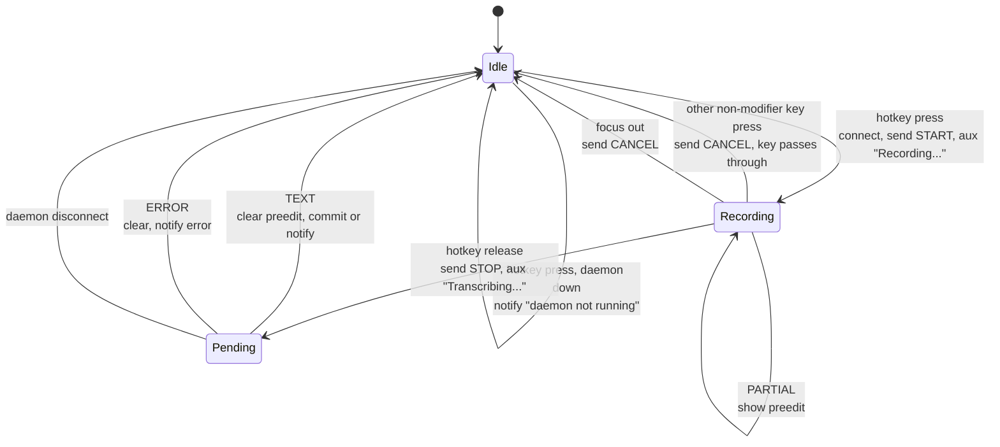
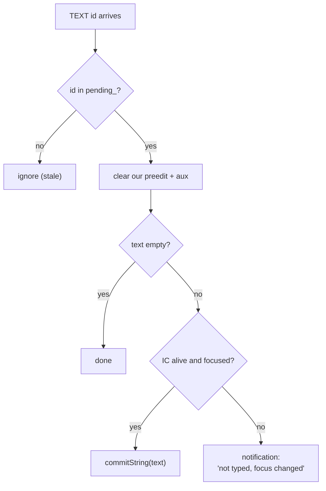

# fcitx5 Addon

Relevant source files

- [addon/koe.h](../addon/koe.h)
- [addon/koe.cpp](../addon/koe.cpp)
- [addon/log.h](../addon/log.h)
- [addon/koe.conf.in](../addon/koe.conf.in)
- [addon/CMakeLists.txt](../addon/CMakeLists.txt)

## Purpose and Scope

The `koe` addon is a fcitx5 module loaded into the fcitx5 process. It turns hotkey presses into protocol messages, shows recording status and live text, and types the final result. It has no threads and never blocks. This page covers its key handling, preedit rules, focus rules, connection handling and config.

## Lifecycle

`KoeFactory` creates one `Koe` instance when fcitx5 starts (`OnDemand=False`). The constructor loads the config and registers two event watchers:

| Event | Phase | Handler |
|---|---|---|
| `InputContextKeyEvent` | `PreInputMethod` | `onKeyEvent` - runs before the active input method sees the key |
| `InputContextFocusOut` | `InputMethod` | `onFocusOut` |

The daemon socket is connected lazily on the first hotkey press, not at startup.

Sources: [addon/koe.cpp:26-41](../addon/koe.cpp#L26-L41), [addon/koe.cpp:491-497](../addon/koe.cpp#L491-L497), [addon/koe.conf.in](../addon/koe.conf.in)

## Hotkey state machine

Notes on each transition:

- **Press.** `event.key().checkKeyList(hotkey)` decides a match. The key is always filtered with `filterAndAccept()`, so the app never sees it.
- **Release.** Matched with `isReleaseOfModifier(pressedKey)` or the same keysym, from any input context. This handles modifier-only hotkeys like `Control_R`, whose release event carries the `Control` state.
- **Shortcut safety.** With a modifier hotkey, the user may press Right Ctrl + C to copy. Any non-modifier key pressed during a recording cancels it, and that key is passed through, so the shortcut still works.
- **Overlap.** A new recording can start while an older request is still `Pending`. Pending requests are kept per id in `pending_`.

Sources: [addon/koe.cpp:419-489](../addon/koe.cpp#L419-L489), [addon/koe.cpp:79-91](../addon/koe.cpp#L79-L91), [addon/koe.cpp:379-394](../addon/koe.cpp#L379-L394)

## Showing status and live text

| What | API | When |
|---|---|---|
| "🎙 Recording..." / "⏳ Transcribing..." | `inputPanel().setAuxUp()` | Press / release |
| Live transcript | `setClientPreedit()` + `updatePreedit()` if the app supports preedit (`CapabilityFlag::Preedit`), else `setPreedit()` in the panel | Each `PARTIAL` |
| Final text | `commitString()` | `TEXT` with focus |
| Errors, lost text | Notifications addon `showTip()` | `ERROR`, or `TEXT` after focus changed |

The preedit is underlined (`TextFormatFlag::Underline`) with the cursor at the end. The addon tracks an `ownsPreedit` flag per request and only ever clears preedit it set itself, so it does not wipe the active input method's own preedit.

Sources: [addon/koe.cpp:93-144](../addon/koe.cpp#L93-L144), [addon/koe.cpp:315-351](../addon/koe.cpp#L315-L351), [addon/koe.h:60-71](../addon/koe.h#L60-L71)

## Focus rules

- **Focus out while recording:** the recording is cancelled.
- **Focus out while transcribing:** the request continues, but our preedit is cleared from the unfocused window.
- **Result arrives after focus moved:** the text is shown in a notification, never typed into a different window.

Sources: [addon/koe.cpp:315-336](../addon/koe.cpp#L315-L336), [addon/koe.cpp:396-417](../addon/koe.cpp#L396-L417)

## Daemon connection

- `ensureConnected()` opens a non-blocking unix socket to `$XDG_RUNTIME_DIR/koe.sock` and registers it with `eventLoop().addIOEvent()`.
- Reads go through a `LineBuffer`. Writes use `send(..., MSG_NOSIGNAL)`. Messages are tiny, so a short write is treated as a broken connection.
- `disconnect()` closes the socket, clears preedit and aux on every affected input context, drops all request state, and notifies the user if a request was in flight.
- The next hotkey press reconnects. So restarting the daemon needs no fcitx5 restart.

Sources: [addon/koe.cpp:146-246](../addon/koe.cpp#L146-L246), [addon/koe.cpp:248-313](../addon/koe.cpp#L248-L313)

## Configuration

Shown in fcitx5-configtool as "Koe Voice Input" and stored in `~/.config/fcitx5/conf/koe.conf`.

| Option | Type | Default | Notes |
|---|---|---|---|
| `Hotkey` | Key list | `Control_R` | Modifier-only and modifier-less keys allowed |
| `Language` | string | `auto` | Sent as `lang=<code>` in `START`, passed through to the backend |

Sources: [addon/koe.h:34-48](../addon/koe.h#L34-L48), [addon/koe.cpp:52-77](../addon/koe.cpp#L52-L77)

## Logging

The log category is `koe`. Enable debug output with `fcitx5 -rd --verbose 'koe=5'`. Add `key_trace=5` to see every key event fcitx5 receives.

Sources: [addon/log.h](../addon/log.h)

## Related pages

- [Wire Protocol](2.1-wire-protocol.md)
- [Troubleshooting](7-troubleshooting.md)
