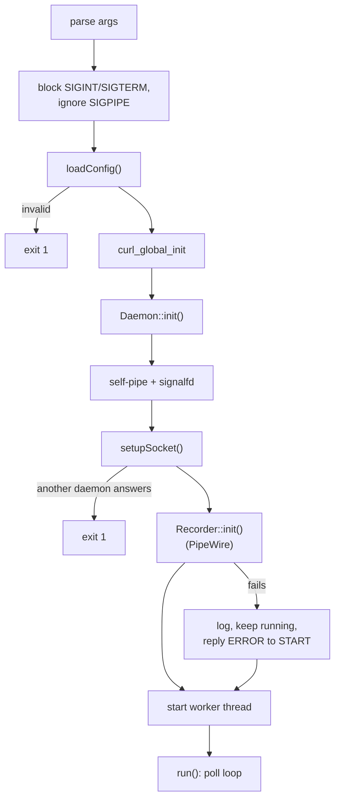
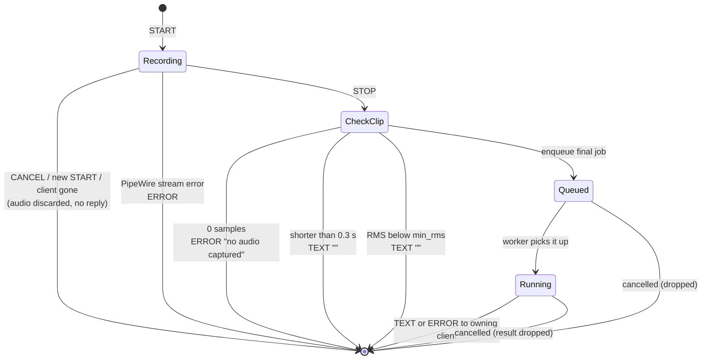
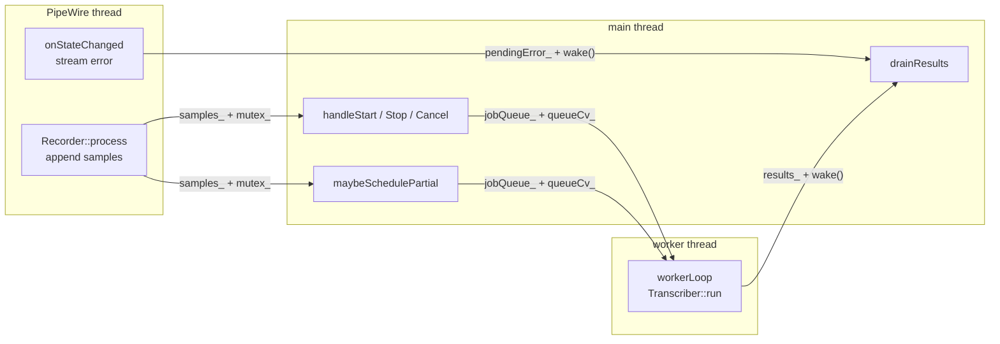

# koe-daemon

<details>
<summary>Relevant source files</summary>

- [daemon/main.cpp](../daemon/main.cpp)
- [daemon/audio.h](../daemon/audio.h)
- [daemon/transcribe.h](../daemon/transcribe.h)
- [daemon/config.h](../daemon/config.h)
- [daemon/CMakeLists.txt](../daemon/CMakeLists.txt)

</details>

## Purpose and Scope

`koe-daemon` is the user process that does the heavy work: it records the microphone, sends audio to the ASR backend, and returns results to the addon. This page covers startup, the event loop, request state and threading. Sub-pages cover [Audio Capture](4.1-audio-capture.md), [Transcription](4.2-transcription.md) and [Configuration](4.3-configuration.md).

## Command line

```
koe-daemon [--config <path>] [--socket <path>] [-v]
```

| Flag | Default | Effect |
|---|---|---|
| `--config` | `$XDG_CONFIG_HOME/koe/config.toml` or `~/.config/koe/config.toml` | Config file. Missing file means built-in local profile |
| `--socket` | `$XDG_RUNTIME_DIR/koe.sock` | Listening socket |
| `-v` | off | Debug lines: per-clip RMS, partial scheduling, messages sent |

All logs go to stderr with a `koe-daemon:` prefix, so journald captures them under the systemd unit. Transcript text is never logged, only its length.

Sources: [daemon/main.cpp:884-956](../daemon/main.cpp#L884-L956), [daemon/main.cpp:42-79](../daemon/main.cpp#L42-L79)

## Startup



- `setupSocket()` first tries to connect to an existing socket file. If something answers, another daemon is running and this one exits without touching the file. Otherwise the stale file is removed, then `bind`, `chmod 0600`, `listen`.
- If PipeWire is unavailable, the daemon still starts and answers each `START` with an `ERROR`. This keeps the addon's error path simple.

Sources: [daemon/main.cpp:891-956](../daemon/main.cpp#L891-L956), [daemon/main.cpp:121-153](../daemon/main.cpp#L121-L153), [daemon/main.cpp:277-330](../daemon/main.cpp#L277-L330)

## Event loop

One `poll()` call waits on everything the main thread cares about:

| fd | Purpose |
|---|---|
| listen socket | New clients |
| self-pipe read end | Wake-ups from the worker (results) and PipeWire (stream errors) |
| `signalfd` | SIGINT / SIGTERM for clean shutdown |
| each client | `POLLIN` for requests, `POLLOUT` while its output buffer is not empty |

The poll timeout is infinite, except while a recording with partials is active. Then it is the time left until the next partial pass. After each wake-up the loop calls `maybeSchedulePartial()`.

Sources: [daemon/main.cpp:155-227](../daemon/main.cpp#L155-L227), [daemon/main.cpp:731-744](../daemon/main.cpp#L731-L744)

## Request lifecycle

The daemon allows **one recording at a time** across all clients. Finished recordings become jobs on a queue for the worker thread.



| Check on STOP | Threshold | Reply |
|---|---|---|
| No samples at all | 0 | `ERROR <id> no audio captured (check microphone)` |
| Too short | `< 4800` samples (0.3 s) | `TEXT <id> ` (empty) |
| Too quiet | RMS `< min_rms` | `TEXT <id> ` (empty) |
| Too long | `> max_record_sec` | Truncated, still transcribed, logged once |

The silence gate matters because the model invents fluent text on silent audio. Without it, an accidental tap of the hotkey could type junk.

Sources: [daemon/main.cpp:540-653](../daemon/main.cpp#L540-L653), [daemon/main.cpp:36-40](../daemon/main.cpp#L36-L40)

## Threading and shared state



- All socket I/O and request state live on the main thread only. Other threads hand data over through a mutex-protected container and a byte on the self-pipe.
- Jobs are `shared_ptr<Job>` with an atomic `cancelled` flag, so the main thread can cancel a job the worker already holds.
- On shutdown, `stopFlag_` aborts an in-flight curl request through its progress callback, the worker is joined, the PipeWire loop is stopped, and the socket file is removed.

Sources: [daemon/main.cpp:81-112](../daemon/main.cpp#L81-L112), [daemon/main.cpp:229-275](../daemon/main.cpp#L229-L275), [daemon/main.cpp:789-850](../daemon/main.cpp#L789-L850)

## Client handling

- Several clients may connect (for example after an fcitx5 restart). Each has a `LineBuffer` for input and a string output buffer, capped at 1 MiB.
- A malformed line, an overflowed buffer, or a client sending server-only verbs gets that client disconnected.
- When a client disconnects, its active recording is cancelled and its jobs are marked cancelled.

Sources: [daemon/main.cpp:344-476](../daemon/main.cpp#L344-L476), [daemon/main.cpp:519-538](../daemon/main.cpp#L519-L538)

## Related pages

- [Audio Capture](4.1-audio-capture.md)
- [Transcription](4.2-transcription.md)
- [Configuration](4.3-configuration.md)
