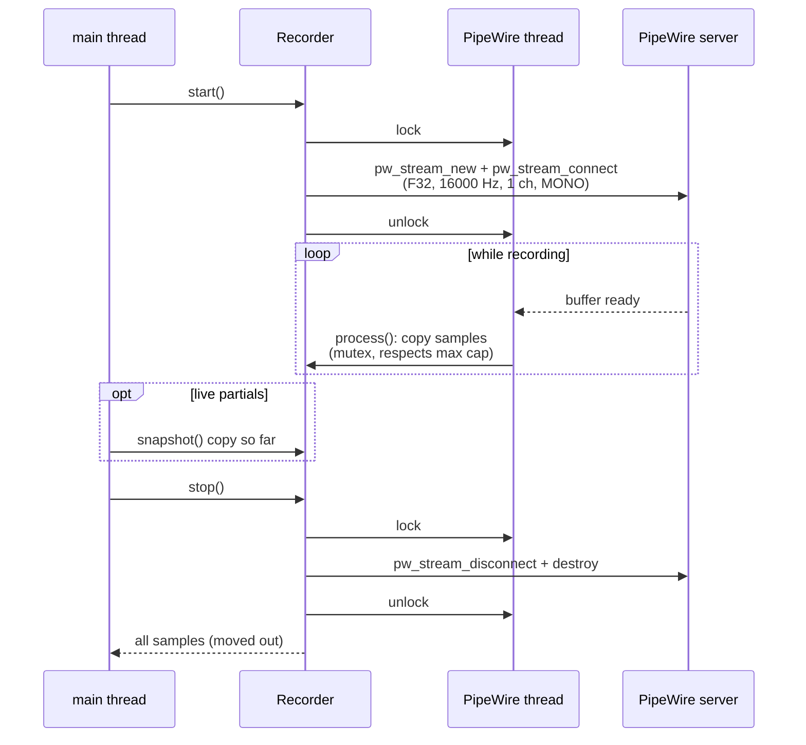

# Audio Capture

Relevant source files

- [daemon/audio.h](../daemon/audio.h)
- [daemon/audio.cpp](../daemon/audio.cpp)

## Purpose and Scope

`koe::Recorder` records the default PipeWire input as 16 kHz mono float samples. It opens the microphone only while the hotkey is held, so the desktop's mic indicator tells the truth. This page covers its setup, recording cycle and error handling.

## Setup

`Recorder::init()` runs once at daemon startup:

1. `pw_init`
2. `pw_thread_loop_new` - PipeWire runs its own thread
3. `pw_context_new` + `pw_context_connect` - one long-lived core connection
4. `pw_thread_loop_start`

`shutdown()` undoes these steps and is safe to call twice.

Sources: [daemon/audio.cpp:15-63](../daemon/audio.cpp#L15-L63), [daemon/audio.cpp:186-214](../daemon/audio.cpp#L186-L214)

## Recording cycle

| Stream property | Value |
|---|---|
| `media.type` / `media.category` / `media.role` | `Audio` / `Capture` / `Communication` |
| `node.name` / `application.name` | `koe` |
| Format | `F32`, 16000 Hz, 1 channel, position `MONO` |
| Flags | `AUTOCONNECT`, `MAP_BUFFERS` |

PipeWire converts from the device's native format and rate, so the daemon never resamples.

The process callback is intentionally **not** marked `RT_PROCESS`. It takes a mutex and grows a `std::vector`, which must not happen on the realtime data thread. Without the flag it runs on the `pw_thread_loop` thread, and because the stream is destroyed under the loop lock, `process()` can never run on a destroyed stream.

Sources: [daemon/audio.cpp:84-184](../daemon/audio.cpp#L84-L184), [daemon/audio.cpp:216-259](../daemon/audio.cpp#L216-L259)

## Buffer handling

- `process()` reads from `data + chunk->offset` and clamps the size so it never reads past `maxsize`.
- The sample buffer is capped at `max_record_sec * 16000`. Extra audio is dropped and the `capped` flag is set, which the daemon logs once on `STOP`.
- `snapshot()` copies the samples captured so far without stopping. It is used for [live partials](4.2-transcription.md#live-partials).

Sources: [daemon/audio.cpp:152-173](../daemon/audio.cpp#L152-L173), [daemon/audio.cpp:220-259](../daemon/audio.cpp#L220-L259)

## Errors

If the stream enters `PW_STREAM_STATE_ERROR`, `onStateChanged` stores the message and wakes the main loop through the self-pipe. The main thread then tears the stream down with `cancel()` and replies `ERROR <id> <reason>`. A device that never delivers audio shows up later as `ERROR <id> no audio captured (check microphone)`.

Sources: [daemon/audio.cpp:261-281](../daemon/audio.cpp#L261-L281), [daemon/main.cpp:637-653](../daemon/main.cpp#L637-L653)

## Choosing the microphone

The stream follows the system's **default input**. To use another mic, change the default (`wpctl set-default <id>`) or move the `koe` stream in pavucontrol while recording. Check levels with `koe-daemon -v`: it logs the RMS of every clip. Normal speech is around 0.05-0.1. A value near 0.001 means the wrong or a muted device. See [Troubleshooting](7-troubleshooting.md).

## Related pages

- [koe-daemon](4-koe-daemon.md)
- [Transcription](4.2-transcription.md)
