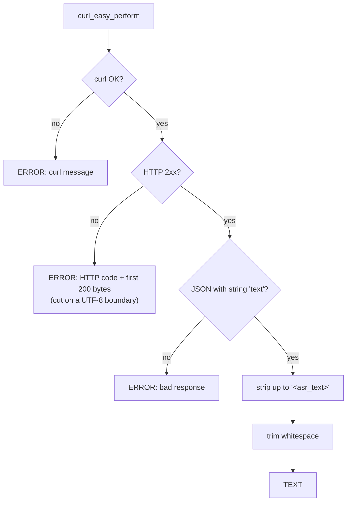
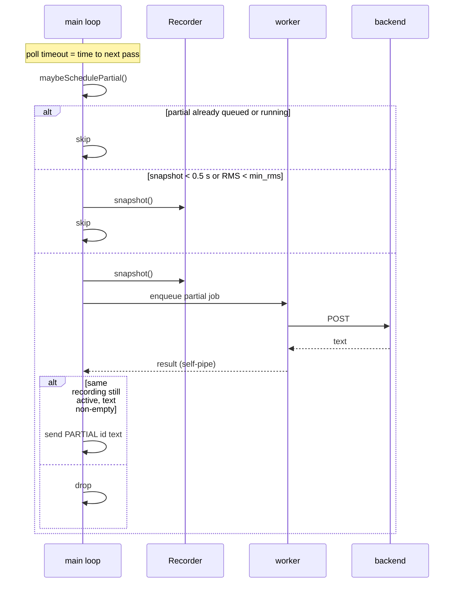

# Transcription

<details>
<summary>Relevant source files</summary>

- [daemon/transcribe.h](../daemon/transcribe.h)
- [daemon/transcribe.cpp](../daemon/transcribe.cpp)
- [daemon/main.cpp](../daemon/main.cpp)

</details>

## Purpose and Scope

This page covers how recorded audio becomes text: the worker thread, the HTTP request to an OpenAI-compatible endpoint, response cleanup, and the live partial passes shown while the user is still speaking.

## Worker thread

One worker thread runs `workerLoop()`. It owns a single `koe::Transcriber`, which keeps one reused `CURL` handle. Jobs come from `jobQueue_`. Each job is either **final** (after `STOP`) or **partial** (during recording). Both use the same request code.

Sources: [daemon/main.cpp:797-850](../daemon/main.cpp#L797-L850), [daemon/transcribe.cpp:105-113](../daemon/transcribe.cpp#L105-L113)

## HTTP request

```
POST <base_url>/v1/audio/transcriptions
Content-Type: multipart/form-data
Authorization: Bearer <key>        (only if api_key_file is set)
```

| Field | Value |
|---|---|
| `file` | WAV bytes in memory, filename `audio.wav`, type `audio/wav` |
| `model` | Profile `model` |
| `language` | Only when lang is not `auto` |
| `prompt` | Only when the profile `prompt` is non-empty (bias for names or jargon) |
| `response_format` | `json` |

- WAV is RIFF PCM 16-bit little endian, mono, 16 kHz. Floats are clamped to [-1, 1].
- `CURLOPT_TIMEOUT` is the profile `timeout_sec` (default 15). Connect timeout is 3 s.
- A trailing `/` in `base_url` is handled.

Sources: [daemon/transcribe.cpp:58-94](../daemon/transcribe.cpp#L58-L94), [daemon/transcribe.cpp:115-181](../daemon/transcribe.cpp#L115-L181)

## Response handling



Some backends prefix the text (for example `language <Name><asr_text>hello`). `stripAsrText()` removes everything up to and including the first `<asr_text>`. Backends without such a prefix are unaffected, so the step is a no-op there.

Sources: [daemon/transcribe.cpp:96-103](../daemon/transcribe.cpp#L96-L103), [daemon/transcribe.cpp:175-225](../daemon/transcribe.cpp#L175-L225)

## Live partials

While the hotkey is held, the daemon re-transcribes the audio captured so far at `partial_interval_ms`, and sends the result as `PARTIAL`.



Rules:

- **At most one partial in flight** per recording. If a pass is slow, the next tick is skipped instead of piling up.
- **STOP wins.** On `STOP`, `CANCEL`, a new `START`, or client disconnect, queued partial jobs are cancelled. A running one finishes, and its result is dropped because the recording is no longer active. The final job waits at most one partial pass.
- **Errors in partials are silent.** They are only logged at debug level. Only the final result can produce an `ERROR`.
- **Cost.** Each pass re-sends the whole clip. On the local GPU this is about 0.2-0.35 s for 3-9 s of audio. For paid cloud APIs, set `partial_interval_ms = 0`.

Sources: [daemon/main.cpp:674-744](../daemon/main.cpp#L674-L744), [daemon/main.cpp:746-787](../daemon/main.cpp#L746-L787), [daemon/audio.cpp:162-165](../daemon/audio.cpp#L162-L165)

## Timing reference

Measured on an RTX 4050 Laptop GPU with Qwen3-ASR-1.7B Q8_0:

| Clip length | Request time |
|---|---|
| 3.5 s | 195 ms |
| 9.0 s | 348 ms |

The CPU-only build took 8-10 s for a 3-4 s clip, which is too slow for live partials.

## Related pages

- [ASR Model](6-asr-model.md)
- [Configuration](4.3-configuration.md)
