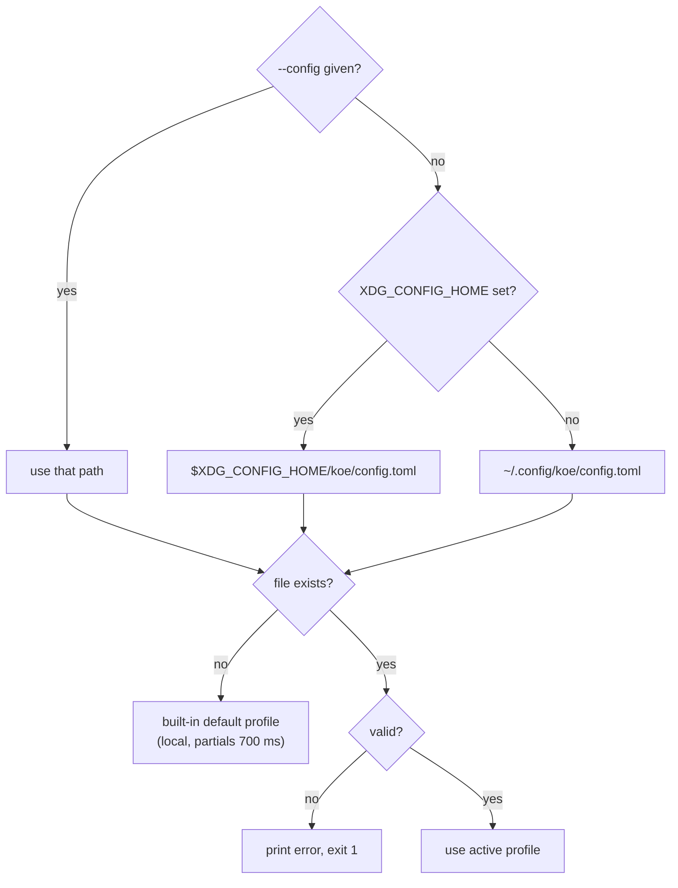

# Configuration

<details>
<summary>Relevant source files</summary>

- [daemon/config.h](../daemon/config.h)
- [daemon/config.cpp](../daemon/config.cpp)
- [nix/config.example.toml](../nix/config.example.toml)
- [addon/koe.h](../addon/koe.h)

</details>

## Purpose and Scope

There are two separate config surfaces. The addon config holds what the user touches often (hotkey, language) and is edited in fcitx5-configtool. The daemon config holds the backend and audio tuning, and is a TOML file. This page lists every option of both.

## Addon options

Stored by fcitx5 in `~/.config/fcitx5/conf/koe.conf`.

| Key | Default | Values |
|---|---|---|
| `Hotkey` | `Control_R` | Any key list. Modifier-only keys allowed |
| `Language` | `auto` | Free string, passed through to the backend |

Sources: [addon/koe.h:34-48](../addon/koe.h#L34-L48)

## Daemon file location



The config is read once at startup. Restart the daemon to apply changes.

Sources: [daemon/config.cpp:27-63](../daemon/config.cpp#L27-L63), [daemon/config.cpp:82-190](../daemon/config.cpp#L82-L190)

## Daemon options

### Top level

| Key | Type | Default | Notes |
|---|---|---|---|
| `active` | string | required | Name of the profile to use |
| `max_record_sec` | int | `120` | Longer recordings are truncated. Must be > 0 |
| `min_rms` | float | `0.005` | Clips quieter than this return no text. `0` disables. Must be >= 0 |
| `save_dir` | string | none | Save each transcribed clip as `<time>-<id>.wav` plus a `.json` sidecar (time, lang, profile, model, duration, rms, text). Empty disables. `~` is expanded |
| `save_min_sec` | float | `0` | Clips shorter than this are not saved. Must be >= 0 |
| `save_keep_days` | float | `0` | Deletes saved clips older than this on each save and at startup. `0` keeps everything. Must be >= 0 |

### `[profile.<name>]`

| Key | Type | Default | Notes |
|---|---|---|---|
| `base_url` | string | required | Server root. The daemon appends `/v1/audio/transcriptions` |
| `model` | string | required | Sent as the `model` field |
| `timeout_sec` | int | `15` | Per request. Must be > 0 |
| `partial_interval_ms` | int | `0` (`700` in the built-in profile) | `0` disables live partials. `1`-`299` is rejected |
| `prompt` | string | `""` | Recognition bias text |
| `api_key_file` | string | none | `~` is expanded. Content is trimmed. Read once at startup, never logged |

Sources: [daemon/config.h:8-24](../daemon/config.h#L8-L24), [daemon/config.cpp:109-188](../daemon/config.cpp#L109-L188)

## Example

```toml
active = "local"
min_rms = 0.005

[profile.local]
base_url = "http://127.0.0.1:8178"
model = "qwen3-asr-1.7b"
partial_interval_ms = 700

[profile.cloud]
base_url = "https://api.openai.com"
model = "gpt-transcribe"
timeout_sec = 30
partial_interval_ms = 0
api_key_file = "~/.config/koe/openai.key"
```

Switching backend means changing `active` and restarting the daemon. The full commented version is [nix/config.example.toml](../nix/config.example.toml).

## Tuning `min_rms`

Run the daemon with `-v` and look for lines like `STOP id=3 rms=0.064656`. Set `min_rms` between your room's silence level and your speech level. Measured on the author's setup: silence about 0.001, speech 0.06-0.09. A mic picking up speaker audio can raise the floor to about 0.02.

## Related pages

- [Transcription](4.2-transcription.md)
- [Deployment](5-deployment.md)
