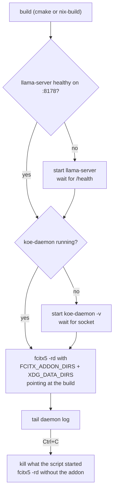
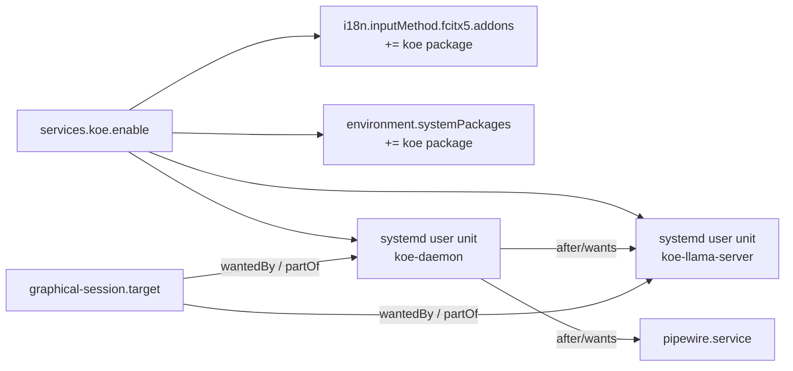

# Deployment

<details>
<summary>Relevant source files</summary>

- [package.nix](../package.nix)
- [default.nix](../default.nix)
- [shell.nix](../shell.nix)
- [nix/module.nix](../nix/module.nix)
- [scripts/dev-run.sh](../scripts/dev-run.sh)
- [CMakeLists.txt](../CMakeLists.txt)

</details>

## Purpose and Scope

This page covers building the project, running it by hand for testing, and installing it permanently. The default path is a cmake build with distro packages.

## Build

| Command | Result |
|---|---|
| `./scripts/install.sh` | Build into `~/.local` (or `--prefix`); installs user services too |
| `cmake -B build -S . && cmake --build build` | Same targets in `build/` for development |

Install paths are relative to the prefix (`lib/fcitx5`, `share/fcitx5/addon`), never fcitx5's own store path. On distros with multiarch libdirs the addon lands under e.g. `lib/x86_64-linux-gnu/fcitx5`; `install.sh` finds it automatically.

Sources: [CMakeLists.txt](../CMakeLists.txt), [addon/CMakeLists.txt](../addon/CMakeLists.txt)

## Manual run (testing)

`scripts/dev-run.sh` starts the full stack in the foreground:



- Logs go to `$XDG_RUNTIME_DIR/koe-dev/` (`llama.log`, `daemon.log`, `fcitx5.log`).
- The build installs to a throwaway prefix under the log dir, so the repo stays clean.

Sources: [scripts/dev-run.sh](../scripts/dev-run.sh)

## Advanced: Nix and NixOS

Nix support is kept but not part of the default install.

| Command | Result |
|---|---|
| `nix build` | `result/lib/fcitx5/libkoe.so`, `result/share/fcitx5/addon/koe.conf`, `result/bin/koe-daemon` |
| `nix-build` | Same targets in `result/` for channel-based setups |

`package.nix` is a plain `callPackage` derivation. `scripts/dev-run.sh --nix` uses it for testing the Nix build.

Sources: [package.nix](../package.nix)

### NixOS module

```nix
imports = [ /path/to/fcitx5-koe/nix/module.nix ];
services.koe.enable = true;
services.koe.llamaServer.cudaCapabilities = [ "8.9" ];
```

What it sets up:



| Option | Default | Notes |
|---|---|---|
| `services.koe.enable` | `false` | |
| `services.koe.package` | `callPackage ../package.nix {}` | |
| `services.koe.llamaServer.enable` | `true` | Set `false` for cloud-only |
| `services.koe.llamaServer.package` | llama-cpp with CUDA | Built from a re-imported nixpkgs, so the global nixpkgs config is untouched |
| `services.koe.llamaServer.cudaCapabilities` | `null` | e.g. `[ "8.9" ]`. Limits the CUDA build to your GPU |
| `services.koe.llamaServer.model` | `%h/.local/share/koe/models/Qwen3-ASR-1.7B-Q8_0.gguf` | `%h` is the systemd home specifier |
| `services.koe.llamaServer.mmproj` | `%h/.local/share/koe/models/mmproj-Qwen3-ASR-1.7B-Q8_0.gguf` | |
| `services.koe.llamaServer.port` | `8178` | |
| `services.koe.llamaServer.extraArgs` | `[ "-np" "1" "-c" "4096" ]` | One slot, 4096 context, keeps VRAM low |

Model files are kept out of the Nix store on purpose (about 2.5 GB). Download them with `./scripts/setup-models.sh download qwen`, see the [README](../README.md#quick-start).

Sources: [nix/module.nix:17-29](../nix/module.nix#L17-L29), [nix/module.nix:32-114](../nix/module.nix#L32-L114), [nix/module.nix:116-161](../nix/module.nix#L116-L161)

## Service management

```bash
systemctl --user status koe-daemon koe-llama-server
systemctl --user restart koe-daemon        # after editing config.toml
journalctl --user -u koe-daemon -f
```

## VRAM

With llama-server's default settings (4 parallel slots, about 7.7k context each), it used about 3.9 GB. The module's `-np 1 -c 4096` keeps one slot, which is enough for a single user and clips up to `max_record_sec`.

## Related pages

- [Configuration](4.3-configuration.md)
- [Troubleshooting](7-troubleshooting.md)
