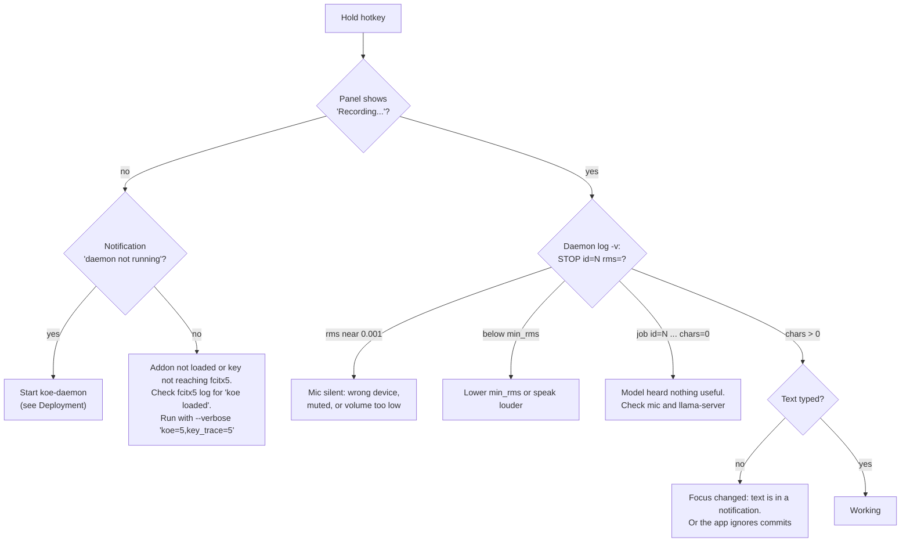

# Troubleshooting

<details>
<summary>Relevant source files</summary>

- [addon/koe.cpp](../addon/koe.cpp)
- [daemon/main.cpp](../daemon/main.cpp)
- [scripts/dev-run.sh](../scripts/dev-run.sh)

</details>

## Purpose and Scope

How to find out where a dictation failed, and fixes for problems seen so far.

## Where did it fail?



## Logs

| Component | Manual run (`dev-run.sh`) | Installed (module) |
|---|---|---|
| Daemon | `$XDG_RUNTIME_DIR/koe-dev/daemon.log` | `journalctl --user -u koe-daemon` |
| llama-server | `$XDG_RUNTIME_DIR/koe-dev/llama.log` | `journalctl --user -u koe-llama-server` |
| fcitx5 / addon | `$XDG_RUNTIME_DIR/koe-dev/fcitx5.log` | run `fcitx5 -rd --verbose 'koe=5'` |

Useful daemon lines with `-v`:

```
koe-daemon: debug: START id=2 lang=auto
koe-daemon: debug: STOP id=2 rms=0.089521
koe-daemon: job id=2 audio=3.476s req_ms=195 chars=23
```

## Known problems

### "Recording..." shows but nothing is typed

- **Cause seen:** the default input device was a USB earphone mic at 25% volume. PipeWire volume is cubic, so 25% is near silent. The clip RMS was 0.00086 and the silence gate dropped it.
- **Fix:** raise the volume or pick the right device.
  ```bash
  wpctl status                                   # list sources, * marks the default
  wpctl set-default <id>
  wpctl set-volume @DEFAULT_AUDIO_SOURCE@ 1.0
  ```

### Junk text on a short tap or in silence

- **Cause:** the model invents text on non-speech audio.
- **Fix:** raise `min_rms` above your room's noise level (see [Configuration](4.3-configuration.md#tuning-min_rms)). Audio playing near the mic can push the noise floor to about 0.02.

### Right Ctrl shortcuts stop working

A non-modifier key pressed during a recording cancels it and passes through, so Right Ctrl + C still copies. If you use Right Ctrl alone for something else, pick another hotkey in fcitx5-configtool.

Sources: [addon/koe.cpp:419-447](../addon/koe.cpp#L419-L447)

### "another koe-daemon is already running"

A daemon already answers on the socket. Stop it (`systemctl --user stop koe-daemon`, or kill it by PID) before starting another one. A stale socket file without a live daemon is removed automatically.

Sources: [daemon/main.cpp:277-305](../daemon/main.cpp#L277-L305)

### llama-server is slow (seconds per clip)

It is running on the CPU. Check `llama.log` for a `CUDA0` line. Use the CUDA build from the README or the module.

### Underlined text stays after switching windows

The addon clears its preedit on focus out, including while transcribing. If text stays, capture `fcitx5 --verbose 'koe=5'` output and the app name. Some apps keep preedit on their own.

Sources: [addon/koe.cpp:396-417](../addon/koe.cpp#L396-L417)

## Related pages

- [Deployment](5-deployment.md)
- [Configuration](4.3-configuration.md)
